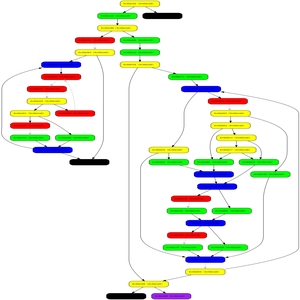
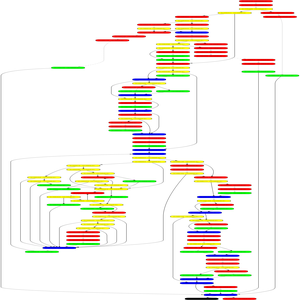
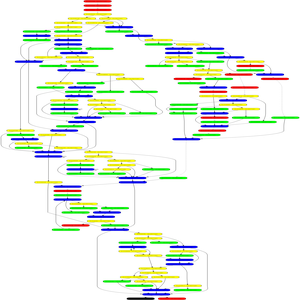
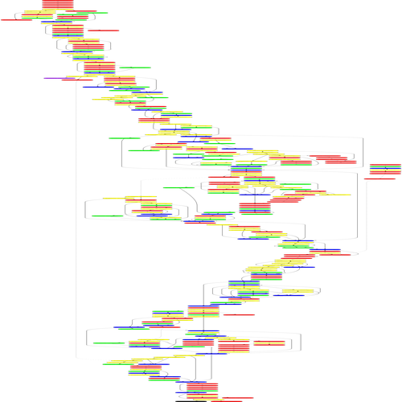

# Extract-thumbernail-CFG

## The tool
The tool take as input a binary file and extract from it the Control Flow Graph of each function and store them as images.
By default the image are stored inside a new folder called thumbnail in a png format.
The name of the function concateneted with "\_cfg" is used as name of the picture.
The block are divided in for different group based on the predecessors and successors (is possible to set the color inside the file library.py):
- Green are transition blocks
- Yellow are "if" block; they present more then one successor
- Blue are block which mainly identify loops, the evaluation is address based over the predecessors and successors
- Red are blocks which end with a call operation
- Black are blocks which end with a ret operation
- Purple is used for block which does not fall in any other category, usually ends with nop operation to align the code and do not present control flow instruction inside the block

Notice that the analysis underlying this choices is heuristic and therefore might be not always correct. Moreover, the options -e and -p which affect the analyses performed can affect the final result.

N.B. If the binary is a position-indipendent executable a warning will pop-up, which will not affect the execution.

## Requirements
Ther required python library can be installed with
```
pip3 install angr-utils
pip3 install bingraphvis
pip3 install Image
pip3 install argparse
```

N.B. In some operative system, when trying to run the program the error:

`FileNotFoundError: [Errno 2] "dot" not found in path`

which is due to the absence of the library graphviz in the system, which is possible to install through

`sudo apt install graphviz`
## How to use

The tool can be called with:
```
Python3 project.py file_name [Options]
```
All available options are:

  -h, --help      show this help message and exit

  -d DSTFOLDER    Folder in which to store the images, the folder is created if does not already exists. By default ./thumbnails folder is used.

  -e              Perform a more accurate analyses of the binary.

  -n              Return a non normalized version of the graph.

  -p              Keep the proportion of the original picture when resizing it.

  -f FORMAT       Format in which store the picture. By default png. Accepted png,jpeg,jpg,gif.

  -s SIZE         Size of the thumbnail in pixels. By default 300.


# Examples

As follow is possible to see part of the result of the tool when applied over the /bin/ls file with the option -e (which perform a more accurate analyses):
Command: `python3 project.py /bin/ls -e`








As follow an example of the result when increasing the size
Command: `python3 project.py /bin/ls -e -s 500`


